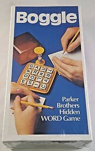

# Get the High Score in Boggle

## To Run
```
$ python3 boggle.py 4 4
```

## Background
While playing Boggle over the holidays I decided to write a program to help me get the high score. Boggle is a board game where players earn points by finding words in a randomized 4 by 4 grid of letters. Valid words are found by connecting at least 3 adjacent letters (diagonal adjacency is valid, but letter reuse is not).  



## The General Problem
In general, Boggle is a specific case of a word search in a grid of letters. The traditional word search (where words must follow a linear path) is another such case. Other cases exist where letter reuse is allowed or where the grid is three dimensional. In this repo, I will limit scope only to solving Boggle on an m by n board.

## Solving Boggle
First, a brute force solution. We could enumerate each and every valid path of letters and check each path against an English dictionary. Enumerating paths with the depth-first search on a 4 by 4 Boggle graph, however, takes too long for this brute force solution to be feasible.\newline\newline
To improve this brute force solution, we can prune the depth-first search. If no words in the English dictionary start with the path generated by the depth-first search, then we do not need to further expand that path. We can also trim the size of the English dictionary by removing all words that cannot be spelled with the letters from the Boggle Board.\newline\newline
This brute force method successfully solves 4 by 4 Boggle boards in less than a second on average. The longest word in the Boggle board shown on the box is "turmoil".

## Future Work
I plan to develop a faster solution. My current work takes several seconds to solve a 5 by 5 Boggle board. I imagine using dynamic programming to build partial solutions (paths of length i) bottom-up by storing paths and pruning those that are not present in any English words (such as "xyz").
